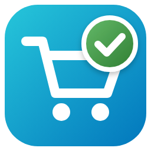
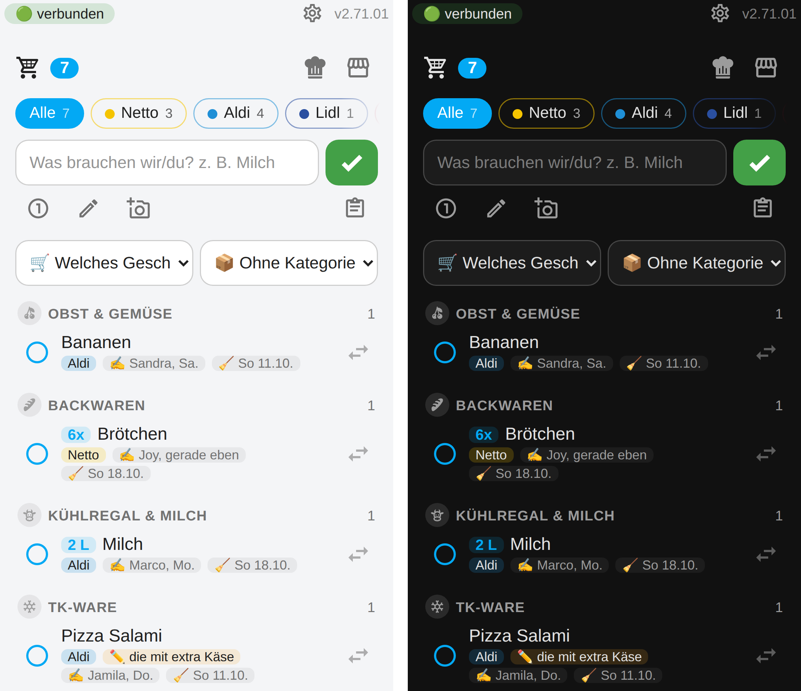
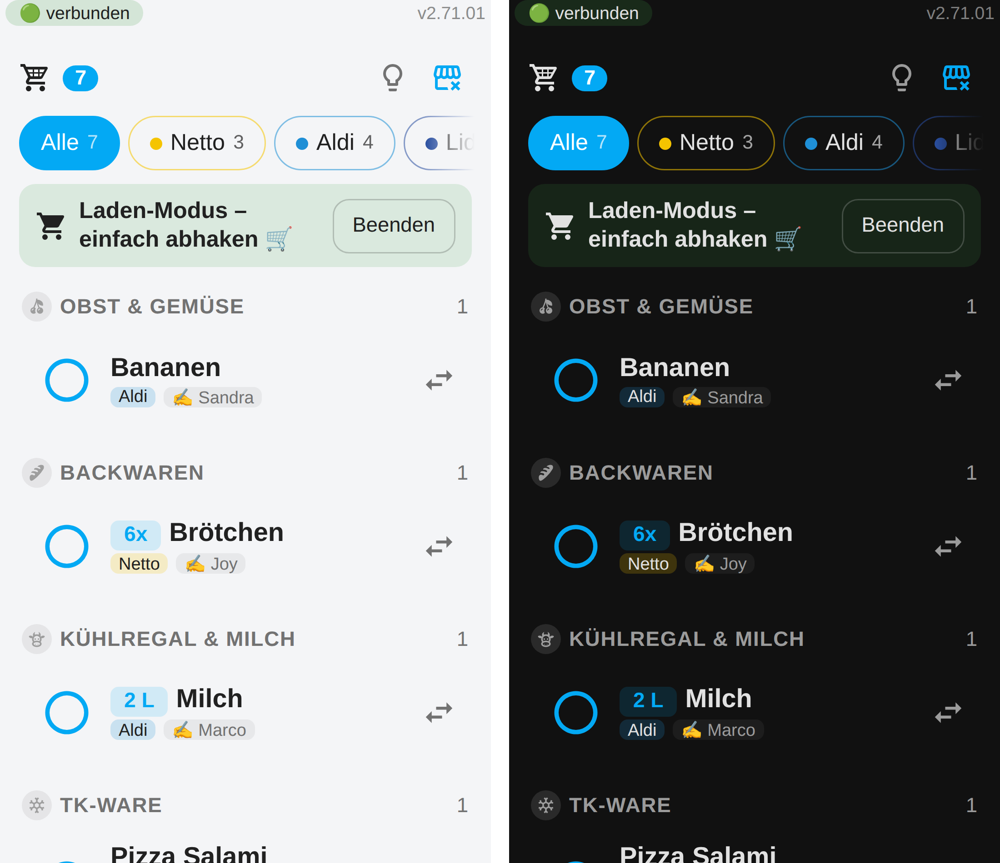

# 🛒 Einkaufsliste für Home Assistant

🇬🇧 **English?** → [README in English](README.en.md)

**Die Familien-Einkaufsliste direkt im Dashboard.** Mehrere Geschäfte, Kategorien, Rezepte und Live-Sync auf allen Handys. Hinter jedem Artikel steht, wer ihn eingetragen hat. Gekauftes wird abgehakt und bleibt als „schon mal gekauft“ stehen – beim nächsten Mal ist es mit einem Tipp wieder drauf.



<details><summary>🛒 Laden-Modus ansehen</summary>



</details>

---

## ✨ Was kann das Ding?

| Funktion | So klappt's |
|---|---|
| 🏪 **Mehrere Geschäfte** | Jedes Geschäft hat oben seinen Reiter. Bist du laut Standort in einem Laden, springt die Liste dorthin. |
| 🗂️ **Kategorien** | Obst & Gemüse, TK-Ware … Die Liste rät die Kategorie selbst („Joghurt“ → Kühlregal). |
| 👨‍👩‍👧‍👦 **Für die ganze Familie** | Jeder mit HA-Benutzer macht mit, ohne Admin-Rechte. Live auf allen Handys. |
| ♻️ **Nichts geht verloren** | Abgehaktes rutscht nach unten zu „Erledigt“. Kreis antippen = wieder drauf. |
| 🏷️ **Für wen & wer** | *Käse (für Oma)* – und klein darunter, wer es eingetragen hat. |
| ⚡ **Schnell eintragen** | „3 milch“, „500 g mehl“ oder „milch, 6 eier, brot“ auf einmal. Vorschläge übernehmen alles vom letzten Mal. |
| 🍽️ **Rezepte** | Zutaten per Tipp auf die Liste, für x Personen umgerechnet. Mit Koch-Modus, Fotos, Teilen und Import (auch Links und US-Maße). |
| 🔍 **Barcodes** | Scannen in der HA-App oder mit der Handykamera in der Offline-App: zu Hause eintragen, im Laden abhaken. |
| 🔁 **„War aus!“** | ⇄ am Artikel: nächstes Mal wieder hier oder gleich in ein anderes Geschäft. Die Liste merkt sich, was oft fehlt. |
| 🛒 **Laden-Modus** | Große Zeilen, nur abhaken – mit einer Hand am Wagen. |
| 📱 **Offline-App** | Die komplette Karte als App fürs Handy, öffnet auch ohne Netz. Änderungen werden nachgeschickt. |
| ⏲️ **Gar-Zeiten** | Spickzettel nach Gerät: 🍲 Herd, 🔥 Backofen, 💨 Heißluftfritteuse. |
| 🧹 **Aufräumen** | Einmal pro Woche wird Altes **abgehakt**, gelöscht wird nichts. |
| 🔒 **PIN** | Das Zahnrad (Einstellungen) nur mit PIN – die Liste bleibt für alle offen. |
| 📸 **Text aus Foto** | Einkaufszettel oder Kassenbon fotografieren, die Karte liest den Text direkt auf dem Gerät (Handschrift klappt nur mit Glück – Text vorher korrigierbar). Überschriften wie „Aldi:“ im Zettel ordnen Artikel dem Geschäft zu, beim Bon kannst du bei mehreren Beträgen den richtigen antippen. Dazu: 🩺 Gesundheits-Ampel (auch als Sensor `sensor.einkaufsliste_gesundheit`), 🐞 Fehler-Protokoll, 🧲 Produkte zusammenführen. |
| 🌍 **Deutsch & Englisch** | Die Karte spricht die Sprache von Home Assistant. |

Dazu viele Kleinigkeiten: Fotos pro Produkt, Spitznamen („Tempos“ = Taschentücher), gelernte Tippfehler, Eigenmarken beim Scannen, Doppelt-Finder, Verlauf, Sicherung, Maskottchen 🛒😊 und mehr.

**🗣️ Mit Alexa:** „Alexa, setz Milch auf die Einkaufsliste“ – und die Milch steht auf *dieser* Liste (siehe [Alexa & andere Listen](#-alexa--andere-listen)).

---

## 📦 Installation

1. **HACS** öffnen → oben rechts **⋮ → Benutzerdefinierte Repositories**.
2. `https://github.com/misterm2310/einkaufslisten-card` eintragen, Typ **Integration**, **Hinzufügen**.
3. Nach **Einkaufsliste** suchen, **Herunterladen**, **Home Assistant neu starten**.
4. **Einstellungen → Geräte & Dienste → Integration hinzufügen → Einkaufsliste**. Aufräum-Tag und Uhrzeit wählen, fertig. 🎉
5. Dashboard → **Bearbeiten → Karte hinzufügen → Einkaufsliste**.

```yaml
type: custom:einkaufsliste-card
```

> 🙌 Eine Ressource musst du **nicht** von Hand eintragen, das macht die Integration selbst.
> Sieht die Karte nach einem Update komisch aus? In der App einmal nach unten ziehen oder im Browser Strg+F5.

<details><summary>Ohne HACS (von Hand)</summary>

Den Ordner `custom_components/einkaufsliste` nach `/config/custom_components/einkaufsliste` kopieren und Home Assistant neu starten.
</details>

---

## 👆 So wird's benutzt

**Eintragen:** Name tippen, grüner Haken ✔. Die Knöpfe darunter: 🔢 Menge · ✏️ Eigene Notiz · 👤 Für wen · 📷 Foto (am Handy: 📷 Kamera · 🖼️ Galerie · 📋 Einfügen – die Kamera öffnet sich über https direkt in der Karte; in der HA-App über die lokale http-Adresse geht gleich die Galerie auf. Am PC: Fenster zum Reinziehen, **Strg + V** (z. B. Screenshot aus dem Prospekt) oder Auswählen) · 🧽 alles leeren. Geschäft und Kategorie sind meist schon richtig ausgewählt. Ein Geschäft fehlt? In der Auswahl **„➕ Neues Geschäft …“** – nur den Namen tippen, den Rest später in ⚙️.

**In der Liste:**
- ⭕ **Kreis** = abhaken. Unten bei „Erledigt“ nochmal = wieder drauf.
- ↩️ **Versehentlich abgehakt?** Unten steht 3 Sekunden „Rückgängig“ (nur bei dem, der selbst abgehakt hat). Nach „Mehrere scannen“ / „Scannen & abhaken“ steht 5 Sekunden „Rückgängig“ für den zuletzt gescannten Artikel.
- ⇄ = war aus (bleibt offen mit „war aus“ oder wandert in ein anderes Geschäft).
- 🤷 **„Egal wo“** = Artikel ohne festes Geschäft. Die stehen in **jedem** Geschäfts-Reiter mit drin (mit Schildchen „🤷 Egal wo“) – egal, wo du gerade bist. Abhaken = überall weg. Mit ⇄ in ein Geschäft verschieben = zieht einfach um, ohne Rest bei „Erledigt“. Andersrum geht's auch: ⇄ → **🤷 Egal wo**. Wird so ein Artikel im Reiter eines Geschäfts abgehakt, gehört er ab dann dorthin (dort unter „Erledigt“, bei den anderen weg) – und kommt beim nächsten Mal wieder dort auf die Liste.
- **Lange drücken** = Menü: bearbeiten, verschieben, Menge, Kategorie, Foto, Barcode, Infos.
- **Auf die Menge tippen** = [−] 2x [＋].
- ✨ = neu seit deinem letzten Blick, die rote Zahl am Reiter zeigt, wie viel Neues dort steht.
- Oben links der **Einkaufswagen** öffnet eine Anleitung für die ganze Familie – samt App-Link zum Kopieren.

**Im Laden:** Der Wagen oben rechts schaltet den **Laden-Modus** ein. Kein Netz? Einfach weiter abhaken, der Punkt oben wird orange ⏳ und alles wird nachgeschickt.

**Rezepte:** Anlegen in ⚙️ → Rezepte (Zutaten genau wie auf der Liste eintragen, oder eine Zutaten-Liste bzw. einen Rezept-Link einfügen). Die **Kochmütze** oben: **Auf die Liste** → anhaken, was fehlt → fertig. Dazu 👥 Personen oder 🍕 Bleche umrechnen, **🔥 Kochen** (Schritt für Schritt), **Teilen** (z. B. WhatsApp) und **⏲️ Gar-Zeiten**. Abgehakte Rezept-Zutaten verschwinden ganz.

---

## 🔍 Barcode scannen

Der ▥-Knopf oben weiß, wo du bist:
- 🏠 **Zu Hause:** Packung scannen → Name, Marke und Kategorie sind ausgefüllt → ✔. Mit **„📦 Mehrere scannen“** kommt jede Packung sofort auf die Liste. Unbekannte landen als „❓ Unbekannt“ drauf – einmal umbenennen, dann kennt die Liste den Barcode.
- ▥ **Barcode nachträglich zuordnen** (lange drücken → Barcode): Heißt das Produkt in der Datenbank anders als bei dir, kannst du einzeln wählen, ob Name und/oder Notiz übernommen werden.
- 🛒 **Im Laden** (Geschäft mit 📍 Zone): Jede gescannte Packung wird auf der Liste abgehakt.

**Wo geht das?**
- In der **Home-Assistant-App** (Android/iPhone) mit deren Scanner – klappt auch über `http://`.
- In der **Offline-App** mit der Handykamera. Beim ersten Mal fragt das Handy, ob die Seite die Kamera nutzen darf. Ohne Netz erkennt sie nur Barcodes, die die Liste schon kennt; eingetragen und abgehakt wird trotzdem (wird nachgeschickt).
- Am PC-Browser gibt's keinen Scanner.

Die Produktnamen kommen aus **Open Food Facts**, **Open Beauty Facts** und **Open Products Facts** (dafür braucht Home Assistant Internet). Eigenmarken wie Milsani, ja! oder Balea landen gleich beim richtigen Geschäft; eigene Marken trägst du in ⚙️ → Geschäfte ein.

---

## 📱 Offline-App

Die **komplette Karte** als eigene App auf dem Startbildschirm – mit Rezepten, Koch-Modus, Gar-Zeiten, Einstellungen und Kamera-Scanner. Sie öffnet auch **ohne Netz** mit dem letzten Stand.

1. Die Adresse kopieren: in **⚙️ → App & Info → Offline-App** oder in der **Anleitung** (Einkaufswagen oben links) – so kommen auch alle ohne Zahnrad dran.
2. Im Handy-**Browser** einfügen (Chrome oder Safari, nicht die HA-App).
3. Mit dem eigenen Home-Assistant-Benutzer anmelden.
4. Browser-Menü → **„Zum Startbildschirm hinzufügen“**.

**↩️ Zurück-Taste:** geht in der App Schritt für Schritt zurück (Fenster zu, Einstellungen eine Stufe hoch, Laden-Modus aus). Erst auf der normalen Liste geht die App zu.

**📱 Schnellmenü (Android):** Lange aufs App-Symbol drücken → ✍️ Eintragen · 🛍️ Laden-Modus · 📷 Scannen – die App geht gleich an der richtigen Stelle auf. (Auf dem iPhone gibt es das für Web-Apps nicht.)

**Nur mit Netz:** neue Barcodes nachschlagen, Produkt-Infos, Rezept-Links, neue Fotos, Sicherung.

**🔄 Nachschicken bei geschlossener App:** Unter **Android mit Chrome** schickt die App gemerkte Änderungen auch dann nach, wenn sie zu ist – Android weckt sie kurz auf, sobald wieder Netz da ist (wann genau, entscheidet Android; bei strengem Akkusparen kann es dauern). Auf dem **iPhone** geht das nicht, dort wird beim nächsten Öffnen nachgeschickt. Jede App hat ihre eigene Warteschlange: Was in der Offline-App gemerkt ist, schickt auch nur die Offline-App nach.

Gut zu wissen: Es braucht eine **https**-Adresse (z. B. Nabu Casa). Ändern zwei Leute gleichzeitig dasselbe, gewinnt die letzte Änderung. iPhones löschen den Offline-Speicher manchmal, wenn die App wochenlang nicht geöffnet wurde – dann einmal mit Netz öffnen.

---

## ⚙️ Die Einstellungen (Zahnrad)

Die Einstellungen sind eine **Liste mit Überschriften** – **📋 Meine Liste · 🎛️ Extras · 💾 Daten · 🩺 Gesundheit · 📱 App & Info** – und nur **eine Ebene tief**. Ein **Suchfeld** ganz oben findet Zeilen nach Name oder Thema („Foto“, „Mail“, „Sicherung“, „Sensor“). Die Überschriften sind erst **zugeklappt**: antippen öffnet sie, die vorherige geht dabei zu (die Suche klappt passende von selbst auf). Jede Zeile unter **🎛️ Extras** hat ihre eigene Seite mit Ein/Aus-Knopf. Unten gibt es den Knopf **📖 Anleitung Einstellungen**; die Anleitung fürs Einkaufen und die Rezepte steht davon getrennt vorne (Einkaufswagen oder Knopf „Anleitung“).

| Zeile | Was drin ist |
|---|---|
| 🏪 **Geschäfte** | Jedes Geschäft als eigene Kachel. Antippen = Name, Farbe, Icon, Reihenfolge, 📍 Zonen (mehrere, z. B. für mehrere Filialen), 🏷️ Eigenmarken und 🗺️ **Kategorien-Folge** (Standard: wie überall – oder eigene, so wie du durch den Laden läufst). Ohne eigenes Icon nimmt die Liste das Icon der Zone (falls sie eins hat), sonst 🛒. |
| 🗂️ **Kategorien** · 👥 **Personen** | Anlegen, umbenennen, Farbe, Icon (einfach „hund“ tippen, ohne „mdi:“), sortieren. |
| 👨‍🍳 **Rezepte** | Zwei Reiter: **Rezepte** (neu, bearbeiten, löschen) und **Rezept-Gruppen**. |
| 📦 **Produkte** | Alles, was die Liste kennt: umbenennen, Kategorie, Geschäft („Gibt's bei“), Spitznamen, Fotos, Barcodes, gelernte Tippfehler, ganz löschen. Dazu „Neu gescannt“ zum Prüfen, 🔽 Filter (ohne Kategorie, ohne Foto, pro Geschäft …) und **➕** (neues Produkt) und **▥** (per Barcode: scannen, Namen bestätigen). Der Filter **🗓️ Seit 3 Monaten nicht gekauft** (zuletzt abgehakt, sonst zuletzt eingetragen; nichts, was auf der Liste oder in einem Rezept steht) zeigt Produkte zum Aufräumen – einzeln oder **alle auf einmal löschen**. Am PC: Klick markiert, ↑↓ blättert, Doppelklick/Enter bearbeitet. · **🗄️ Daten aus Datenbank** (Produkt mit Barcode: zeigt Name, Notiz, Nutri-Score und Allergene aus der Datenbank neben deinen Daten; du wählst einzeln, ob Name und/oder Notiz übernommen werden) · **✏️ Eigene Notiz** (das einzige Notiz-Feld zum Selbertippen, bleibt beim Produkt, wird von der Datenbank nie überschrieben; die 📝 Notiz kommt nur noch aus dem Barcode, alte Notizen lassen sich mit „Notiz → ✏️“ verschieben) · **📥 Foto neu holen** (Produkt mit Barcode: holt das Foto noch einmal aus der Barcode-Datenbank, abgeschnittene Fotos werden ersetzt) · **🔄 Alle Fotos neu holen** (Wolken-Symbol bei „Alle Produkte“: holt für alle Produkte mit Barcode die Fotos aus der Datenbank neu und ersetzt alte Datenbank-Fotos; eigene Fotos bleiben; am Ende steht, wo die Datenbank kein Foto hat) |
| 💾🩺 **Daten & Gesundheit** | **Alles ok?** (findet kaputte Einträge; bei jedem Fund 🔧 Beheben, ✏️ Selbst ändern und – wo nötig – eine Auswahl, oder anhaken und alles auf einmal reparieren) · **Import & Sicherung** (Rezepte aus Datei, Listen aus anderen Apps – einmal oder 🔁 automatisch –, Sicherung als .zip; Datei-Import und Sicherung nur Admins) · **Verlauf** (wer hat wann was gemacht, „📈 Oft nicht bekommen“, per ✖ ausblendbar) · **Aufräumen** · **📊 Ressourcen** (wie viel Platz Daten und Fotos brauchen) · **🏷️ Angebote** (siehe unten) |
| 🎛️📱 **Extras, App & Info** | **Offline-App** (deine Adresse mit „Kopieren“) · **Maskottchen** 🛒😊 (Schalter gilt für alle) · **📍 Laden-Modus automatisch** (Schalter gilt für alle Geräte, auch in der Offline-App; der Standort bleibt bei jedem selbst: er geht nur an, wenn *dein* Handy in die Zone kommt) · **🧾 Einkaufs-Protokoll** (Schalter gilt für alle, siehe unten) · **Schutz** (PIN 4–8 Ziffern fürs Zahnrad; vergessen? Geräte & Dienste → Einkaufsliste → Konfigurieren → „PIN zurücksetzen“, nur Admins – ehrlich gesagt: Schutz vor Verstellen, kein Tresor). Solange das Zahnrad offen ist, steht oben ein 🔓 – antippen sperrt sofort · **Hell / Dunkel** (nur in der Offline-App: automatisch, hell oder dunkel) |
| 🆕 **Was ist neu** | Was sich in der aktuellen Version geändert hat. Steht auch in der Anleitung. |
| 🙏 **Credits** | Version, wer's gemacht hat, Links zu GitHub und „Fehler melden“. Steht auch in der Anleitung. |

### 🧹 Aufräumen, einfach erklärt
Am Aufräum-Tag wird alles **abgehakt**, was mindestens 7 Tage (einstellbar) offen ist. Beispiel Sonntag: Am Dienstag eingetragen → am ersten Sonntag erst 5 Tage alt, bleibt → am zweiten Sonntag abgehakt. Unter jedem Artikel steht mit 🧹, wann es so weit ist. Gelöscht wird nichts. Tag und Uhrzeit: **Geräte & Dienste → Einkaufsliste → Konfigurieren**.

### 📍 Nächstes Geschäft zuerst
Für jedes Geschäft eine **Zone** anlegen (Einstellungen → Bereiche, Beschriftungen & Zonen → Zonen) und sie in ⚙️ → Geschäfte → Geschäft antippen → 📍 auswählen. Mehrere Filialen? Einfach mehrere Zonen beim selben Geschäft wählen. Wer seinen Standort über die Companion-App sendet, landet im Laden automatisch im richtigen Reiter.

### 🗣️ Alexa & andere Listen
Die Einkaufsliste kann eine andere To-do-Liste aus Home Assistant **automatisch leer räumen**: Alles, was dort landet, wandert sofort herüber und wird dort gelöscht.

1. In Home Assistant die Integration **„Alexa Devices“** einrichten. Dann taucht die Alexa-Einkaufsliste als To-do-Liste in HA auf.
2. In der Karte **⚙️ → Daten → Import & Sicherung → Aus anderen Apps → 🔁 Automatisch herüberholen**: die Alexa-Liste wählen (und auf Wunsch ein Geschäft), **Einschalten**. 🔒 Einschalten und ändern dürfen nur Admins.
   Du kannst **mehrere Listen** nehmen (z. B. „Alexa Einkaufsliste“, „Alexa Aldi“, „Alexa DM“): jede bekommt **ihr eigenes Geschäft** (oder „Egal wo“) und **ihre eigene Art** des Abgleichs (siehe unten).
3. Ab jetzt: „Alexa, setz Milch auf die Einkaufsliste“ → Milch steht drauf, mit „🔁 Alexa“ als Eintrager.
4. **Wie abgeglichen wird**, wählst du dabei aus:
   - 🗑️ **Holen & dort löschen** – Alexa ist nur der Briefkasten.
   - 🔗 **Bei beiden behalten** – steht auf beiden Listen; abgehakt (oder bei Alexa gestrichen) wird auf beiden Seiten.
   - 🔄 **Voller Abgleich** – wie 🔗, und alles, was du in der Einkaufsliste einträgst, landet auch bei Alexa („Milch (2 L)“ – Geschäft, Notiz und Fotos kennt Alexa nicht). Dann liest dir „Alexa, was steht auf meiner Einkaufsliste?“ alles vor.

   Ehrlich gesagt: Benennst du bei Alexa etwas um, kann die Liste das nicht sicher zuordnen – im Zweifel gibt's einen neuen Eintrag.

Das geht mit jeder To-do-Liste in HA (Google Tasks, Bring!, Todoist, die HA-Einkaufsliste …). Ehrlich gesagt: „Hey Google, …“ schreibt in Google Keep, und Keep hat keine offizielle Verbindung zu Home Assistant – mit Google klappt es deshalb so nicht.

### 🧾 Einkaufs-Protokoll
In **⚙️ → Extras → Einkaufs-Protokoll** einschalten (gilt für alle, standardmäßig **aus**). Dann sitzt oben in der Karte ein **🧾-Knopf** (und einer im Verlauf). **➕ Eintragen:** nach dem Einkauf Geschäft, Betrag und Datum – **wer** und **wann** setzt die Liste selbst. **📊 Auswertung:** zusammengerechnet, **pro Geschäft** und **pro Monat**, mit Filtern nach **Person**, **Geschäft** und **Datum** (Schnellwahl *Dieser Monat / Letzter Monat / Alles*). Unabhängig von den Listen – der Betrag wird von Hand eingetragen. Alle in der Familie sehen alles; falsch eingetragen → ✖. **🎉 Automatisch fragen (Option):** Im selben Kasten kannst du einschalten, dass der Eintragen-Dialog von selbst aufgeht, sobald alles auf der Liste abgehakt ist (Geschäft schon ausgewählt, gilt für alle). Ausschalten versteckt nur die Anzeige, die Einträge bleiben gespeichert.

### 🏷️ Angebote aus den Prospekten (inoffiziell)
In **⚙️ → Extras → Angebote** einschalten (nur Admins): Postleitzahl, auf Wunsch nur bestimmte Geschäfte, wie oft nachgeschaut wird (alle 3–24 Stunden). Steht etwas von deiner Liste gerade im Angebot, bekommt der Artikel vorn ein kleines **🏷️** – antippen oder lange drücken → **Angebote** zeigt Geschäft, Preis, alten Preis und wie lange es gilt. **🛒 Hier kaufen** legt den Angebots-Artikel in diesem Geschäft an – mit dem Namen des Angebots und „🏷️ 1,19 € bis Sa.“ in einem **eigenen Feld** (nicht in der Notiz; startet das Angebot erst später, steht „ab Mo.“) – und hakt das ursprüngliche Produkt ab. Artikel aus Angeboten sind beim Abhaken ganz weg. Läuft das Angebot ab, wird ein dadurch entstandener Artikel 1 Tag später gelöscht und dein ursprüngliches Produkt kommt wieder auf die Liste (Angebot an deinem eigenen Produkt: nur das Angebot fällt weg) (gibt's das Geschäft bei dir nicht: anlegen oder „Egal wo“).

**Angebote suchen:** Produkt oben eintippen (z. B. „Kaffee“) → unter den Vorschlägen **🏷️ Angebote für „Kaffee“ anzeigen** → **➕ Auf die Liste**. Läuft ein Angebot ab, bleibt der Artikel drauf – nur der Angebotspreis verschwindet, 1 Tag lang steht **⌛ Angebot vorbei** dran.

⚠️ **Ehrlich gesagt:** Die Angebote kommen von **Marktguru**, aber **inoffiziell** – ohne Absprache mit Marktguru. Die Einkaufsliste öffnet dafür einfach die Marktguru-Webseite, so wie dein Browser es auch tut (im Code steht kein Zugangsschlüssel). Das kann **jederzeit ohne Vorwarnung aufhören** zu funktionieren; dann steht in ⚙️ „gerade nicht verfügbar“ und die Liste läuft normal weiter. Nachgeschaut werden nur die Namen offener Artikel und deine Postleitzahl. Standardmäßig ist das **aus**.

### 📧 Per E-Mail auf die Liste
1. Eine **eigene Mail-Adresse** nur für die Einkaufsliste anlegen und in Home Assistant die Integration **„IMAP“** damit einrichten.
2. In der Karte **⚙️ → Daten → Import & Sicherung → 📧 E-Mail**: Postfach wählen, auf Wunsch ein Geschäft, was danach mit der Mail passiert (📬 liegen lassen · 👁️ als gelesen markieren · 🗑️ löschen), **erlaubte Absender** eintragen (mindestens einer), **Einschalten**. 🔒 Nur Admins.
3. Mail an die Adresse schicken – **jede Zeile ein Artikel** („Milch“, „6 Eier“ …). Mehrere in einer Zeile gehen auch: „Milch, Butter, Brot“. Anrede („Hallo …“), Grüße („Viele Grüße“, „LG“), Signatur, Zitate, „Gesendet von meinem iPhone“ und ganze Sätze werden übersprungen, Mengen erkannt. Kommt die Mail ohne Zeilenumbrüche an (manche Handy-Mail-Apps), holt die Liste sie sich selbst nochmal richtig aus dem Postfach. Im Verlauf steht 📧.
4. **Geschäft gleich mitschicken:** Steht ein Geschäft im **Betreff** („Aldi“, „Einkauf bei Aldi“), kommt alles dorthin. Oder als **Überschrift** in der Mail: `Aldi:` – darunter die Sachen – dann `DM:` … Auch in einer Zeile: `Netto: Milch, Brot`. Unbekannte Namen landen beim eingestellten Geschäft.

Ehrlich gesagt: Absender lassen sich fälschen – deshalb eine Adresse nehmen, die nicht öffentlich ist. Je nach Postfach dauert es ein paar Sekunden bis Minuten, bis eine Mail ankommt. Gelesen markiert oder gelöscht werden nur Mails, aus denen wirklich etwas auf die Liste kam – fremde Mails bleiben liegen. Bei Gmail heißt „löschen“ je nach Einstellung „archivieren“.

---

## 🎛️ Karten-Optionen

Alles geht im visuellen Editor. Für YAML-Fans:

| Option | Standard | Was macht das? |
|---|---|---|
| `store` | `all` | `all` = alle Geschäfte mit Reitern, sonst nur ein Geschäft |
| `show_title` | `true` | `false` blendet den Einkaufswagen oben (Anleitung) aus |
| `show_added_by` | `true` | zeigt, wer eingetragen hat |
| `added_by_style` | `name` | `name`, `first` (Vorname) oder `initials` |
| `show_checked` | `true` | Bereich „Erledigt“ anzeigen |
| `show_dates` | `true` | „seit Di“ und das 🧹-Datum anzeigen |
| `show_recipes` | `true` | Kochmütze anzeigen |
| `show_settings` | `true` | Zahnrad anzeigen (z. B. fürs Kinder-Tablet aus) |
| `compact` | `false` | kleinere Zeilen ohne Zusatz-Infos |
| `auto_store` | `true` | automatisch zum Geschäft springen, bei dem man gerade ist |
| `language` | `auto` | `auto` = wie Home Assistant, `de` oder `en` |

---

## 🤖 Für Automationen

| Sensor | Was zeigt er? |
|---|---|
| `sensor.einkaufsliste_offene_artikel` | alle offenen Artikel (Attribute `pro_geschaeft`, `artikel`, `abgehakt`, `naechstes_aufraeumen`) |
| `sensor.einkaufsliste_<geschäft>` | **pro Geschäft** die offenen Artikel, Attribut `artikel` |
| `binary_sensor.einkaufsliste_etwas_zu_kaufen` | an, sobald etwas offen ist |
| `sensor.einkaufsliste_zuletzt_eingetragen` | letzter Artikel mit `von`, `wann`, `geschaeft` |

| Aktion | Was passiert |
|---|---|
| `einkaufsliste.add_item` | Artikel auf die Liste (`name`, optional `store`, `category`, `quantity`, `note`, `for_whom`, `added_by`) |
| `einkaufsliste.add_recipe` | alle Zutaten eines Rezepts auf die Liste (`name`) |
| `einkaufsliste.check_item` | Artikel abhaken (`name`, optional `store`) |
| `einkaufsliste.remove_item` | Artikel löschen (`name`, optional `store`) |
| `einkaufsliste.cleanup` | jetzt aufräumen, mit `force: true` alles abhaken |

Events: `einkaufsliste_item_added`, `einkaufsliste_cleanup`.

```yaml
# Beispiel: Nachricht, wenn man bei Aldi ankommt und dort etwas auf der Liste steht
triggers:
  - trigger: zone
    entity_id: person.anna
    zone: zone.aldi
    event: enter
conditions:
  - condition: numeric_state
    entity_id: sensor.einkaufsliste_aldi
    above: 0
actions:
  - action: notify.mobile_app_annas_handy
    data:
      message: "🛒 Bei Aldi stehen {{ states('sensor.einkaufsliste_aldi') }} Sachen auf der Liste"
```

---

## ❓ Häufige Fragen

**Wo liegen die Daten?** Lokal in Home Assistant (`/config/.storage/einkaufsliste.data`, Fotos in `/config/einkaufsliste_fotos`). Keine Cloud. Deine HA-Backups sichern alles mit, dazu gibt's ⚙️ → Daten → Import & Sicherung.

**Die Karte sagt „Integration nicht eingerichtet“.** Dann fehlt Schritt 4 der Installation.

---

## 🧪 Für Entwickler

**Eigenmarken und Kategorie-Wörterbuch ergänzen – ohne Programmieren:** Beides steht in eigenen Dateien unter `custom_components/einkaufsliste/data/`:
- `eigenmarken.json` – nach Land (`DE`, `AT`, `CH` …, wie in HA unter Einstellungen → System → Allgemein eingestellt) → Kette → Marken. Unbekanntes Land = alle zusammen.
- `kategorien.json` – pro Kategorie die Stichworte im Kategorie-Namen (`match`) und die Produkte je Sprache (`words`: `de`, `en`, gern auch `nl`, `fr` …).

Einfach ergänzen und als Pull Request schicken 🙏

```bash
pip install -r requirements_test.txt
pytest
```

Lizenz: MIT · Produktdaten: [Open Food Facts](https://world.openfoodfacts.org) (ODbL) · Symbole in der Offline-App: [Material Design Icons](https://pictogrammers.com) (Apache 2.0) · Barcode-Leser in der Offline-App: [ZXing-js](https://github.com/zxing-js/library) (Apache 2.0)
